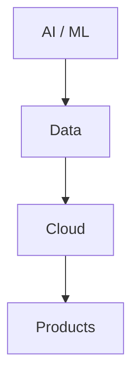
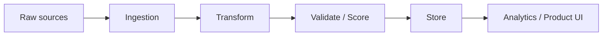
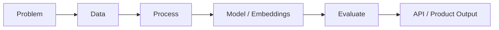

<div align="center">

# Hi, I'm Vinay 👋

### MS Computer Science @ Northeastern University · Expected May 2027

**AI / ML · Data Engineering · Cloud · Analytics · Product Building**

</div>

> I build data-driven systems, AI/ML applications, and cloud-based solutions that turn complex problems into practical products — and I'm building [Synvix](https://synvix.in) along the way.

<div align="center">

[LinkedIn](https://linkedin.com/in/vinaysj2003) · [Portfolio](https://macrosensor2022.github.io/Portfolio/) · [Synvix](https://synvix.in) · [GitHub](https://github.com/macrosensor2022)

<br/>


</div>

---

### How I think about systems



---

## About Me

| | |
|:--|:--|
| **About** | **Currently** |
| MS Computer Science @ Northeastern (Roux) | Building [Synvix](https://synvix.in) |
| Expected graduation: May 2027 | Shipping AI / data / automation systems |
| AI/ML · Data Engineering · Cloud · Analytics | Growing a production-oriented open-source portfolio |
| Founder / builder · technical systems focus | Exploring cloud + data platform patterns |

---

## Experience

**Bangor Savings Bank**  
`Data Engineering Co-op · 2026`  
SQL, ETL/data workflows, data validation, SQL Server/SSMS, SSIS, and Azure/cloud concepts in a real banking data environment.  
<sub>Public-safe summary only — no proprietary systems or internal details.</sub>

**Steelcase / Northeastern Working Lab**  
`Conversational Intelligence Analytics Engineer`  
NLP and analytics engineering on large-scale conversational datasets for workplace intelligence products.  
<sub>High-level only · details under NDA.</sub>

**Northeastern University**  
`Teaching Assistant — Algorithms (CS5800)`  
Graduate algorithms support, problem solving, and technical mentoring.

**Data for Social Good Club — Northeastern**  
`AI Engineer`  
Applied machine learning to social-impact and community-focused data problems.

**Besant Technologies**  
`Data Scientist Intern`  
Data validation automation, SQL/EDA optimization, and Power BI dashboards.

**Bluebase Software Solutions**  
`Software Developer Intern`  
AWS infrastructure (VPC, EC2, Auto Scaling), Linux deployment automation, and backend/API work.

---

## Building Synvix

### [Synvix](https://synvix.in) · Founder / Builder

Technology venture focused on modern digital products — websites, full-stack applications, and AI/data solutions for teams that need to ship reliable systems.

Discover → Design → Develop → Launch

→ [synvix.in](https://synvix.in)

---

## Featured Projects

### [find_jobs](https://github.com/macrosensor2022/find_jobs) — JobTracker
End-to-end job command center: multi-source scraping, explainable scoring, and a Flask-backed workflow for DE / Analytics / BI roles.

`Python` `Flask` `SQL` `Automation`

**What it demonstrates:** product thinking, data pipelines, ranking logic, and usable tooling — not just a notebook.

→ [View repository](https://github.com/macrosensor2022/find_jobs)

---

### [Log Classification System](https://github.com/macrosensor2022/Log_classification_system_NLP_Personal_project)
Hybrid NLP log classification: regex → transformer embeddings → model serving with FastAPI.

`Python` `NLP` `FastAPI` `SentenceTransformers` `scikit-learn`

**What it demonstrates:** multi-stage ML systems design and production-style model serving.

→ [View repository](https://github.com/macrosensor2022/Log_classification_system_NLP_Personal_project)

---

### [Pocket Forecaster](https://github.com/macrosensor2022/pocket_forecaster)
AI-assisted smartphone recommendation system with MVC architecture and hybrid review sentiment analysis.

`Java` `NLP` `MVC` `SparkJava`

**What it demonstrates:** software architecture + NLP applied to a real recommendation workflow.

→ [View repository](https://github.com/macrosensor2022/pocket_forecaster)

---

### [E-commerce Text Classification (FastText)](https://github.com/macrosensor2022/Text-Classification-on-E-commerce-Data-using-FastText)
FastText multi-class product text classification with subword embeddings for noisy e-commerce text.

`Python` `FastText` `NLP`

**What it demonstrates:** practical NLP baselines that train fast and handle messy retail text.

→ [View repository](https://github.com/macrosensor2022/Text-Classification-on-E-commerce-Data-using-FastText)

---

### [AWS Production Environment Lab](https://github.com/macrosensor2022/Building-a-Robust-AWS-Production-Environment)
Hands-on AWS production networking lab — VPC, bastion access, and load-balanced web patterns.

`AWS` `VPC` `EC2` `Linux`

**What it demonstrates:** cloud networking fundamentals used in real deployments.

→ [View repository](https://github.com/macrosensor2022/Building-a-Robust-AWS-Production-Environment)

---

### [Flask on EC2](https://github.com/macrosensor2022/Deploying-a-flask-web-app-on-a-linux-machine-using-an-Amazon-EC2-instance)
Flask application deployment on Amazon EC2 with nginx and Gunicorn.

`Python` `Flask` `AWS` `nginx`

**What it demonstrates:** app → reverse proxy → process manager deployment path.

→ [View repository](https://github.com/macrosensor2022/Deploying-a-flask-web-app-on-a-linux-machine-using-an-Amazon-EC2-instance)

---

## How the work maps

| AI / ML | Data Engineering | Cloud |
|:--------|:-----------------|:------|
| Log Classification | JobTracker pipelines & scoring | AWS Production Lab |
| Pocket Forecaster NLP | SQL / ETL / validation (co-op) | Flask on EC2 |
| FastText e-commerce NLP | Analytics / Power BI experience | VPC · bastion · ALB patterns |

---

## Data Engineering

From raw signals → usable decisions:



Seen across JobTracker (ingest → transform → score → serve) and professional data workflows (SQL, ETL, validation).

---

## AI / ML



Focus areas: NLP, transformers / sentence embeddings, classification systems, FastAPI model serving.

---

## Cloud & Infrastructure

```text
Infrastructure → Security / Access → Compute → Storage → App Deploy
     VPC              Bastion            EC2       Data      Flask + nginx
```

---

## Technical Focus

**Languages**  
`Python` `SQL` `Java`

**AI / ML**  
`Machine Learning` `NLP` `Transformers` `Embeddings` `FastText` `scikit-learn`

**Data**  
`SQL Server` `SSIS` `ETL` `Data Validation` `Data Quality` `Pandas`

**Cloud**  
`AWS` `Azure` `EC2` `VPC` `Docker` `Linux`

**Analytics / Backend**  
`Power BI` `Flask` `FastAPI` `REST`

---

## Education

**Northeastern University** — MS Computer Science · Expected May 2027  
**Sri Venkateswara College of Engineering** — B.E. Computer Science

---

## Currently Building

- **[Synvix](https://synvix.in)** — technology services + AI/data product work
- **JobTracker** — automation for DE / Analytics job search workflows
- **NLP / data systems** — classification, embeddings, API-served ML pipelines

---

<div align="center">


</div>

---

## Let's Connect

Open to conversations around **AI**, **data engineering**, **cloud systems**, and interesting technical problems.

[LinkedIn](https://linkedin.com/in/vinaysj2003) · [Portfolio](https://macrosensor2022.github.io/Portfolio/) · [Synvix](https://synvix.in) · [GitHub](https://github.com/macrosensor2022)
